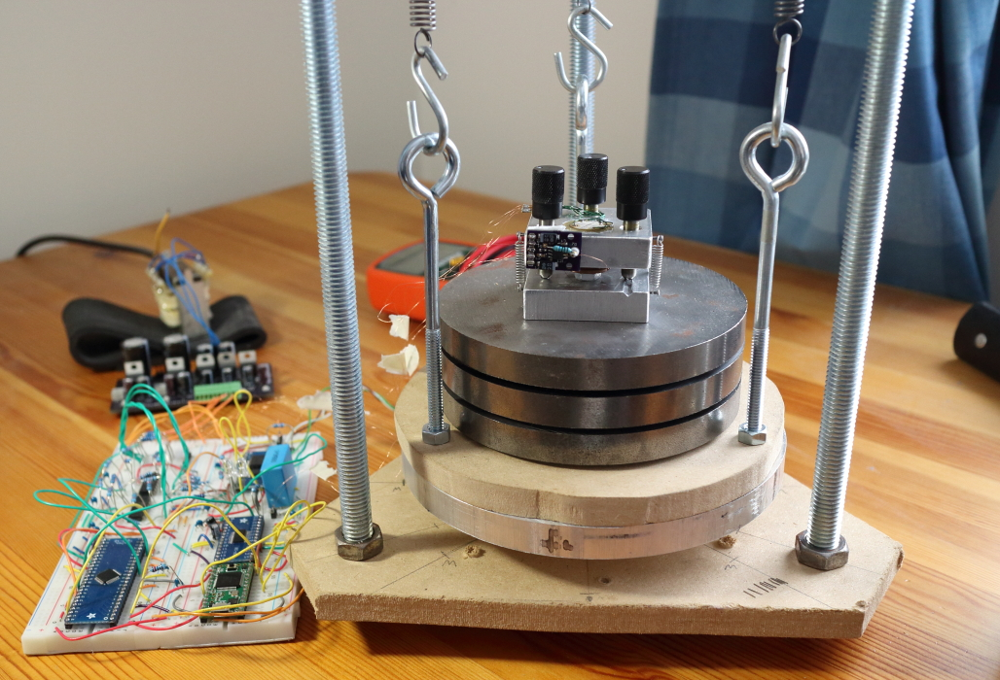
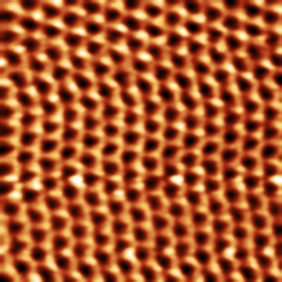

# 自制扫描隧道显微镜（STM）

1. 扫描头
2. STM尖端
3. 隔振
4. 电子设备
5. 软件
6. 图片库
7. 友情链接

这个项目是我尝试构建能够在空气中进行原子分辨率成像的低成本扫描隧道显微镜（STM）。通常用于 STM 的压电扫描仪的成本至少为数百美元。不久前，我看到了 John Alexander 的[简单 STM 项目](https://john-alexander42.github.io/simple-stm-web-page/index.htm)，其中他使用了一种廉价的压电蜂鸣器元件，其中一个电极被切成象限，以实现 XYZ 运动。这种类型的扫描仪没有通常用于 STM 的扫描仪那么严格，但我决定尝试一下，看看我能用它走多远。事实证明，我能够使用 STM 以原子分辨率对高取向热解石墨 (HOPG) 进行成像！下图显示了石墨的六方晶格结构。

## 技术概述

STM 是一种能够以原子分辨率对表面进行成像的工具。在 STM 中，将锋利的金属针置于距离导电样品表面几埃的范围内，并在间隙上施加小的偏置电压。如果间隙足够小（<1 nm），电子可以通过量子隧道穿过间隙。这种“隧道电流”通常在 pA – nA 范围内，可以使用跨阻放大器进行测量。 STM 尖端安装在压电扫描仪上，该扫描仪能够在所有方向上进行亚埃运动。由跨阻放大器测量的隧道电流被馈送到反馈环路，该反馈环路控制施加到压电扫描仪的 Z 轴电极的电压，并用于保持恒定的隧道电流，从而保持恒定的尖端与样本距离。扫描仪的 X 轴和 Y 轴用于对样品上的尖端进行光栅扫描。通过测量作为扫描位置函数的 Z 轴电压，构建样品形貌的图像。如果尖端靠近样品表面，隧道电流呈指数增加。这种指数关系使得 STM 足够灵敏，即使在环境条件下也能分辨单个原子。如果 STM 尖端具有原子级锐度（并不像您想象的那么难实现！），那么几乎所有隧道电流都将流过尖端上最靠近样品表面的单个原子，从而产生具有原子分辨率的图像。

译注：

$1pA = 10^{-12}A$

$1nA = 10^{-9}A$

$1埃(Angstrom) = 10^{-10}m$

$1nm = 10^{-9}m$

