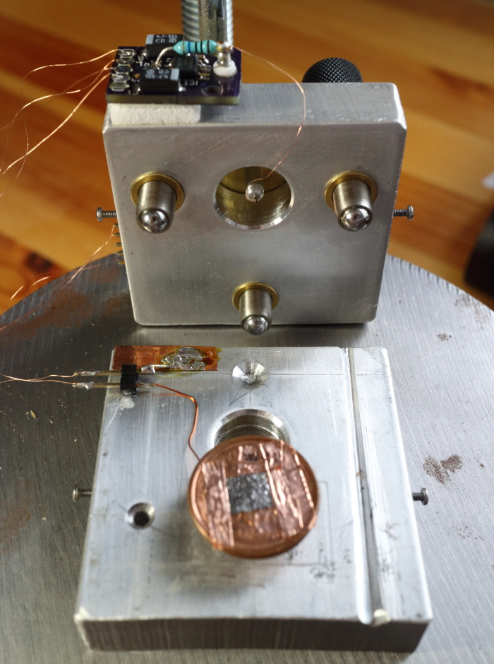

# 扫描头

## 压电扫描仪

压电致动器可以实现亚纳米级定位分辨率，并用于所有扫描探针显微镜。大多数使用压电管执行器，有些使用压电堆栈执行器。重要的是，执行器必须具有刚性，以最大限度地减少振动对尖端与样品距离的影响。管式扫描仪往往比由堆栈执行器制成的扫描仪更坚固，但价格并不便宜。任何一种类型的扫描仪都至少要花费几百美元，因此我决定制作 John Alexander 发明的“unimorph 磁盘扫描仪”，并将其用于[他的低成本 STM 设计](https://john-alexander42.github.io/simple-stm-web-page/Disk_Scanner_Exp.htm)中。该扫描仪基于廉价的压电蜂鸣器，其中一个电极被切成象限，因此单个蜂鸣器用于 XYZ 运动。 STM 尖端安装在粘在蜂鸣器上的支架上。通常使用导电环氧树脂将电线粘合到电极上，因为焊接产生的多余热量会使压电陶瓷去极化。不管怎样，我用低温焊接了我的，我的执行器工作得很好，尽管我可能有陶瓷的去极化部分。

我使用的[蜂鸣器](http://www.digikey.ca/product-detail/en/7BB-20-6/490-7711-ND/4358151)直径为 20 毫米，谐振频率为 6.3 kHz。鉴于它们被设计用作扬声器，这些东西并不是特别坚硬（特别是粘有支架），因此它们的性能不如压电管扫描仪。我测得组装好的扫描仪的最低共振频率为 3.4 kHz。我仍然能够实现原子分辨率，但将来我可能会改用具有更高谐振频率的较小扫描仪，看看它是否可以提高性能。

STM 尖端安装在针座中，以便快速轻松地更换。插座粘在铝支架上钻的孔中。支座粘在一个小蓝宝石盘上，该蓝宝石盘粘在蜂鸣器的黄铜电极上以实现电绝缘。重要的是要确保没有胶水将铝管（与 STM 尖端电连接）直接连接到黄铜电极（接地），以防止电流从尖端泄漏到地面。蓝宝石是比胶水更好的绝缘体，这一点很重要，因为我们处理的是非常小的电流信号。玻璃或陶瓷也是在这里使用的好材料，但我会避免在扫描仪结构中使用塑料。

下图是安装了扫描仪的 STM 的俯视图，显示了被切成象限的顶部压电电极。我只是使用 x-acto(译注：精密切割刀具品牌) 切割电极，同时小心不要过多损坏压电陶瓷。

蜂鸣器每施加伏特的位移比管扫描仪大得多（[John Alexander的蜂鸣器扫描仪](https://john-alexander42.github.io/simple-stm-web-page/Disk_Scanner_Exp.htm)约为约 160 nm/V，管扫描仪在 Z 方向约为 10 nm/V），这意味着它们必须为了达到相同的分辨率，可以用低得多的电压驱动。管扫描仪通常使用大约 ±200 V 电源运行，而我使用 ±15 V 电源运行扫描仪。理想情况下，Z 方向的分辨率应为 ~0.01 nm 或更好，这对应于位移为 160 nm/V 的扫描仪的 62.5 μV。对于 OPA4227 等低噪声运算放大器来说，这不成问题，而且 ±15 V 电源可提供充足的行程范围。请记住，输入范围为 ±10 V 的 16 位 ADC 的分辨率为 305 μV，因此需要额外的放大（增益至少为 5）或更精确的 ADC 才能在恒流成像模式（即反馈环路处于活动状态）。在恒定高度模式下（禁用反馈环路并通过测量隧道电流获取图像），前置放大器为原子分辨率成像提供足够的放大。

## 扫描头和粗略接近机构

STM 扫描头由两个 2英寸乘2英寸乘1/2英寸(译注:5.08cm x 5.08cm x 1.27cm)铝块制成，通过三个 1/4英寸-80 精密调节螺钉(译注：螺纹直径 1/4英寸=6.35mm 螺栓间距 每英寸80螺纹=每2.54cm80螺纹)连接。您可以从 McMaster Carr(译注：美国私营硬件、工具、原材料、工业材料和维护设备供应商) 获得[细牙螺钉](http://www.mcmaster.com/#97424a590/=11pmnis)和[黄铜螺纹衬套](http://www.mcmaster.com/#98625a960/=11pmoim)。铝制零件是用钢锯、钻床和锉刀制成的。螺钉具有球形头，可通过运动方式连接至铝制底座。一个球头与锥体（用钻头制成）配合，一个与 V 形槽（用锉刀制成）配合，一个与平面配合（我使用了蓝宝石圆盘，但仅使用铝的平坦表面）就可以了）。下面给出的尺寸以毫米 [英寸] 为单位。

精密调节螺钉用于在实验开始时将尖端和样品带入隧穿距离。反馈回路在此接近过程中运行，因此接近机构必须能够使尖端足够靠近样品，使其处于扫描仪 Z 轴的行程范围内（在本例中约为 3 μm）。精密调节螺钉布置在三脚架中，其中两个前面的螺钉靠近扫描仪，用作粗略接近。扫描仪的位置与连接两个前螺钉的线偏移约 1 毫米，因此后螺钉的运动减少了约 30 倍，并且提供了更精细的调节。我首先使用前螺丝将尖端尽可能靠近样品，而不将其撞到表面，然后慢慢转动后螺丝，直到建立隧道电流。我目前正在手动执行此操作，但计划添加一个步进电机来控制后螺杆，以便使接近过程更加自动化，从而降低接近过程中尖端碰撞的风险。我只需用铜箔胶带将样品安装到一便士硬币上，然后将其粘到安装在 STM 底座上的磁铁上。样品偏置线焊接到镀镍磁铁上，并通过一块显微镜盖玻片与接地底座电绝缘。这样可以快速、轻松地更换样品。

铝并不是 STM 主体的最佳材料，因为它具有相当大的热膨胀系数。 Macor（一种可加工陶瓷）可能是最佳材料，因为它的热膨胀系数与压电陶瓷的热膨胀系数非常匹配。不过，热膨胀并不是什么大问题，因为它通常在图像中显示为斜坡，并且可以在后处理中轻松校正。粗略接近后，热漂移有时会成为一个问题，但几分钟后它就会趋于稳定，并且通常可以运行 2 小时以上，而不会漂移出扫描仪的垂直行程范围。

Pingback：[ShareAHack.com |这个DIY便宜的STM显微镜实际上可以看到原子](https://shareahack.com/assets/this-diy-cheap-stm-microscope-can-actually-see-atoms/)

Pingback： [关于压电晶体的问题|物理论坛 - 科学与社区的融合](https://www.physicsforums.com/threads/question-about-piezo-crystals.855351/#post-5366763)

Pingback： [深奥的执行器 |每日黑客新闻](http://dailyhackersnews.com/2015/12/10/esoteric-actuators/)

Pingback： [深奥的执行器 | 黑客日报](http://hackaday.com/2015/12/10/esoteric-actuators/)

译注：

ADC 模数转换器 模->数

$1μV = 10^{-6}V$

$1μm = 10^{-6}m$