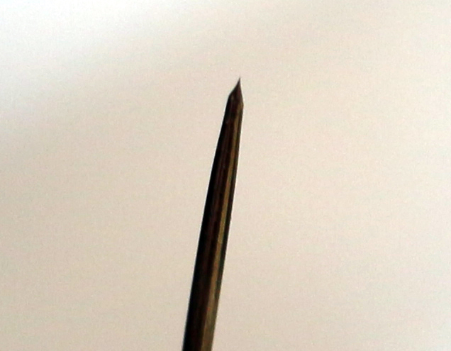

# STM尖端

为了获得原子分辨率，STM 尖端需要具有原子级锐度，以便大部分隧穿电流仅流过一个原子。我刚刚用钢丝钳从 30 AWG(译注：美国线规，30AWG=0.255mm直径) 钨丝上切割尖端。该技术是用一把钳子拉动电线，同时用钢丝钳以一定角度切割。由于钨是比钢丝钳更硬的材料，因此结果并不理想，但在 HOPG 上的原子分辨率方面，大多数时候似乎工作得很好，可能是因为 HOPG 局部原子平坦。尽管对于较大的扫描，该技术给出的结果好坏参半，而且显然使用铂铱丝效果更好，因为它是一种更软的材料，也比钨更耐氧化。您还可以用氢氧化钾对钨尖端进行电化学蚀刻，这会产生质量更好的尖端，但尖端最终会被一层很难去除的薄氧化层覆盖。

我使用“薄片”技术在 4M KOH(4M=4mol/L 氢氧化钾) 中蚀刻了照片上的尖端，施加 4V 电压，其中钨丝被蚀刻在 KOH 薄片中，该薄片是通过将一圈钢丝浸入 KOH 中而形成的。 KOH 薄片径向蚀刻导线，蚀刻完成后，薄片下方的导线就会脱落。