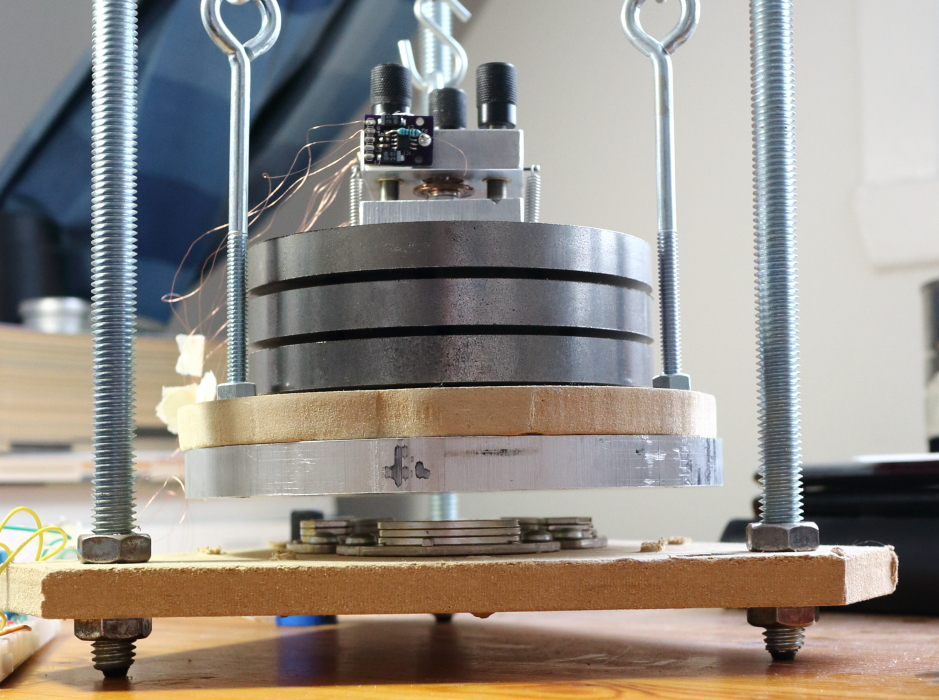

# 隔振

良好的隔振和阻尼对于 STM 至关重要。由于STM扫描头相当刚性，低频振荡只会导致整个STM头振荡，而不会影响尖端到样本的距离，但较高的频率会引起问题。我住在高速公路和机场附近，所以我进行了相当复杂的设置。

STM 头安装在三块 5 英寸直径 x 1/2 英寸厚(译注：12.7cm直径x1.27 cm厚)的钢板上，每块钢板由 3 小片从 O 形环切下的全氟橡胶隔开。氟橡胶是一种非常有效的减振器。该堆栈安装在 MDF 板(译注：中密度纤维板)和铝板上，由三个 2 英尺长的弹簧悬挂。这将创建一个谐振频率为 1 Hz 的摆（与水平振动分量隔离）和一个谐振频率为 2 Hz 的谐振子（与垂直振动分量隔离）。我还将三堆三个硬盘驱动器磁铁连接到底座上，当靠近铝板时，会提供一些涡流阻尼。当铝板移动到磁铁附近（沿任何方向）时，板遇到的变化的磁场会在板中感应出涡流。涡流产生一个与板运动相反的磁场（通过吸引或排斥硬盘驱动器磁铁），从而有效地抑制振动。我还使用非常细的 40 AWG(40AWG=0.0799mm直径)电线将扫描仪、前置放大器和样本偏置连接到面包板上的电子器件，以最大限度地减少振动传输。整个设备安装在小橡胶脚上。

