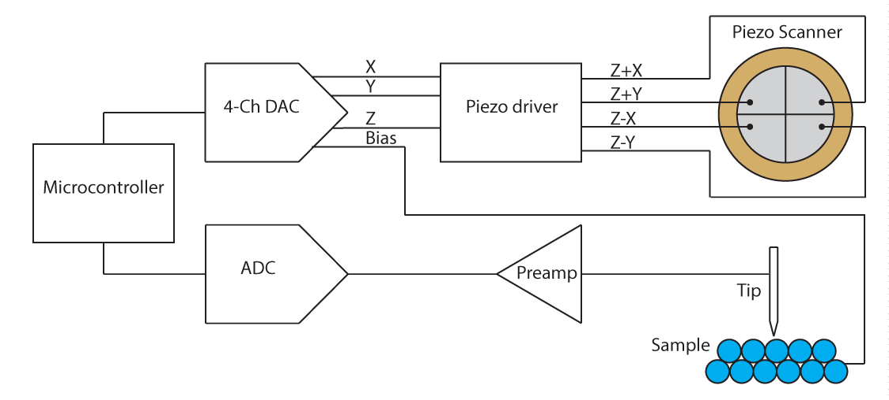
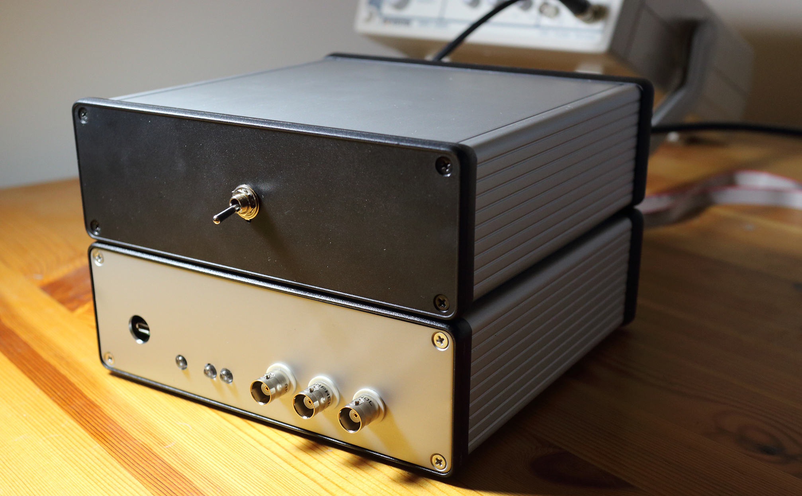
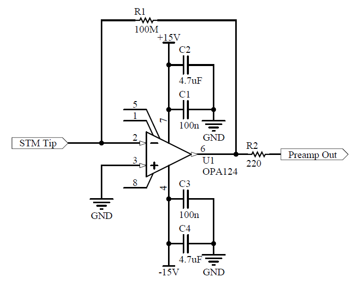
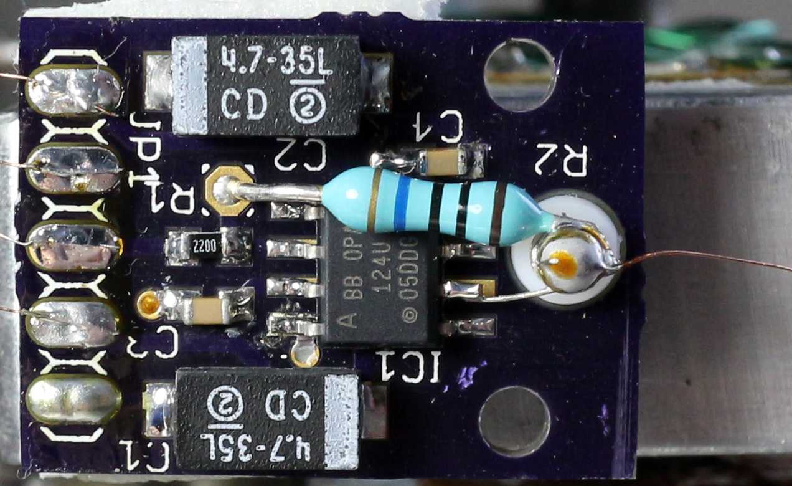

# 电子设备

- [OSH Park上的前置放大器PCB](https://oshpark.com/shared_projects/XQKkLpe6)
- [前置放大器 PCB Eagle 文件](https://drive.google.com/file/d/0B14id-NJ2Pb2TjE1c0FYdElHOGM/view?usp=sharing&resourcekey=0-X9teah6iqMW33tFa4mrOrA)
- [模拟PCB原理图](https://dberarddotcom.files.wordpress.com/2015/06/stm_analog4.pdf)
- [模拟PCB gerber文件](https://app.box.com/s/uok2zzd5col1gkhutndglprov51pesz1)
- [模拟 PCB Altium Designer文件](https://drive.google.com/file/d/0B14id-NJ2Pb2bDlRaS1zVEp6QVU/view?usp=sharing&resourcekey=0-UK92Uv7ItYa8gssbqa7nPA)

## 电路概述

STM电子器件的工作原理是这样的：微控制器（Teensy 3.1）通过使用DAC生成X和Y扫描信号，以光栅模式扫描针尖。同样由DAC产生的直流偏置电压被施加到导电样品上，当电子靠得足够近（<1 nm）时，电子会穿过尖端和样品之间的间隙。该电流由前置放大器测量，前置放大器输出与隧穿电流成正比的电压。该信号被数字化并馈送到PI控制环路中，其输出被发送到DAC并用于驱动扫描仪的Z轴，使尖端跟踪样品表面。真正令人惊奇的是，这实际上效果非常好！当尖端靠近样品表面时，隧穿电流呈指数级增长（每埃约10倍），这就是STM如此灵敏的原因，以至于能够在普通的环境条件下分离单个原子。

输入（隧道电流）和输出（Z轴）信号都通过USB发送到PC，随着扫描的进行，在PC上逐行构建图像。我编写了一个 C# 程序来解决这个问题，并允许我设置各种扫描参数。

Teensy目前安装在一块原型板上，与模拟主板分开。我计划最终用更快的东西替换它。

## 隧穿电流前置放大器

前置放大器是一个 OPA124 运算放大器，具有一个 100MΩ 反馈电阻器，配置为跨阻放大器。放大器的输出电压就是隧穿电流乘以反馈电阻的值。使用100 MΩ电阻，它可以测量高达100 nA的电流。我通常以 ~1 nA 左右的设定值操作显微镜，但在这里有几个额外的数量级范围很重要，因为隧穿电流随针尖-样品距离呈指数变化。

我之所以选择 OPA124，是因为它具有低输入偏置电流和低电流噪声。还有许多其他方法也运行良好：OPA627 似乎是 STM 的热门选择;OPA129 适用于在非常低的电流下进行测量;LTC6268的输入偏置电流低得离谱，但我不知道有人在 STM 中使用它。输入偏置电流需要明显低于隧穿电流，否则测量将非常不准确。OPA124 的输入偏置电流约为 1pA。

我在自己的小PCB上构建了前置放大器，并将其直接安装在STM头上。一根 40 AWG(40AWG=0.0799mm直径)短线将 STM 尖端连接到前置放大器输入。在扫描过程中，我在 STM 上放置了一个金属罐，以保护尖端和前置放大器。如果没有屏蔽，STM产生的图像主要由60 Hz噪声拾音器主导。

由于隧穿电流非常小，因此需要注意避免泄漏电流。泄漏到运算放大器输入节点的电流将与前置放大器的隧穿电流相加，并产生显著的失调误差，因此理想情况下，我们希望保持漏电流小于输入偏置电流。这意味着前置放大器输入节点需要与其他导体很好地绝缘。我用特氟龙支架 （[Keystone Electronics 11301](https://www.digikey.ca/products/en?keywords=Keystone%20Electronics%2011301&from=home)） 绝缘了输入节点，并将运算放大器的输入引脚从 PCB 表面弯曲。不过，在输入节点周围带有保护环的表面贴装反馈电阻器可能是更好的选择，因为它可以降低寄生电容和提高带宽。[OPA124 数据表](http://www.ti.com/lit/ds/symlink/opa124.pdf)对此进行了介绍。

## 数据采集

由于前置放大器位于主PCB之外，因此我正在进行差分测量，以补偿接线中可能拾取的噪声。前置放大器输出和接地信号由一个 LT1469 双通道运算放大器 （U12） 进行缓冲和滤波，该运算放大器将输入驱动至一个 LTC2326-16 16 位伪差分 ADC （U10）。

## 反馈回路

Teensy 3.1 使用包含 2^16 个条目的查找表（即每个可能的 ADC 读数对应一个条目）获取输入数据的对数（因为隧道电流随尖端-采样距离呈指数变化）。线性化信号被馈入PI环路，PI环路输出Z压电信号。

## 扫描仪输出

Teensy 通过一个DAC8814 4 通道 16 位乘法 DAC 输出 X、Y 和 Z 信号。精度在这里不是特别重要，但分辨率和动态范围很重要。STM需要能够跟踪原子表面特征，同时具有足够的行程范围来补偿一些热漂移。Z轴的行程约为~2 μm，因此16位DAC的1 LSB为~0.05 nm。这是亚原子的，但对于 STM 来说仍然有点“粗糙”。理想情况下，它应该小于 0.01 nm。一种解决方案是通过改变一些电阻值来减小Z轴行程范围。不过，这个行程范围在补偿热漂移方面很有用，因此我改用Σ-Δ调制将有效DAC分辨率提高到20位。这实质上意味着在DAC的步进之间执行PWM，并使用低通滤波器对输出进行滤波。[本文](http://www.embedded.com/design/configurable-systems/4006431/Sigma-delta-techniques-extend-DAC-resolution)对该技术进行了很好的解释。这会将分辨率降低到2pm左右，前提是噪音保持在足够低的水平。理论上，该电路的信噪比在120dB以上。但是，我的 STM 实现的实际分辨率并不那么好。我可以很容易地在石墨上解析单个原子（相对容易，因为它是一种原子平坦的非金属），但在金上却不行。这可能是由于以下因素的某种组合：振动、声音、噪声拾取、热效应、尖端质量差、DAC 毛刺 （？） 等。

## 压电驱动器

STM通常使用相当大的电压（通常约为±200 V）来驱动扫描仪。但是，像我使用的压电蜂鸣器在低电压下具有相对较大的行程，因此我为压电驱动器使用±15 V电源。这在所有轴上提供了大约 ~2 微米的行程。X、Y 和 Z 信号由运算放大器 U3 和 U6 组合，产生 Z+X、Z-X、Z+Y 和 Z-Y 信号，以驱动 4 个扫描电极。扫描仪的黄铜电极板接地，用于保护 STM 尖端免受扫描电极的影响。

## 电源

我使用标准线性稳压器和变压器产生±15 V、+5V和+3.3V电源。主要的STM模拟PCB应该与变压器和电源线隔离，所以我把电源放在一个单独的盒子里。

## 接线和PCB结构注意事项：

连接器P5是模拟主板的电源输入，采用±15V、+5V和+3.3V输入。

目前，我将 Teensy 放在一块单独的原型板上，以便以后可以升级它。连接器 P1 连接到 Teensy，如下所示。确保剪掉 Teensy 板底部的小跳线，将 Vin 与 Vusb 分开。

    所有 GND -> GND
    +5V -> Vin
    ~CS_DAC -> Teensy pin 20
    ~LDAC -> pin 17
    ~CS_ADC -> pin 21
    CNV -> pin 4
    BUSY -> pin 3
    MISO_ADC -> pin 12
    MOSI_DAC -> pin 11
    SCK_ADC and SCK_DAC -> pin 13.

连接器 J1 连接到扫描仪。J2 进入前置放大器。在 J2 上，“PREAMP+”进入前置放大器输出，“PREAMP-”进入前置放大器接地。我正在使用带状电缆将电路板连接到 STM。带状电缆是软的，应该在一定程度上有助于隔振。坚硬的电缆就像机械天线。我选择了这些连接器的引脚排列，以便使将电路板连接到 STM 的带状电缆总是接地。

以下组件是可选的：U8、U9、U11、U13、R33、P2、P3、P4。它们主要用于需要锁相放大器的 dI/dV 频谱。如果省略这些元件，请安装0欧姆跳线（或仅焊桥）W1和W2，它们在ADC输入端旁路ADG419开关（U9和U13）。

一些钽电容器极性未在 PCB 上标明，因此如果您打算构建此板，请参阅本页顶部的 PCB 照片。 **不要向后安装钽电容器，因为它们可能会起火！** 您甚至可以尝试完全省略它们，因为如果您使用低噪声线性电源为电路板供电，它们可能就没有必要了。

我有由 Teensy 驱动的 LED，用于指示何时建立隧道。这有助于手动粗略接近。

译注：

$1埃(Angstrom) = 10^{-10}m$

$1pA = 10^{-12}A$

$1μm = 10^{-6}m$

$1pm = 10^{-12}m$