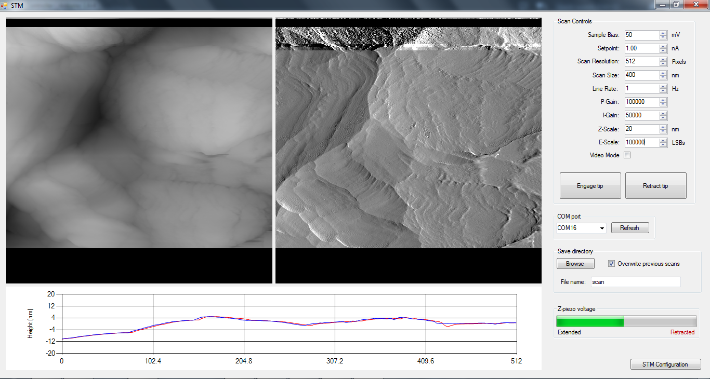

# 软件

我终于抽出时间为我的 STM 完成 Teensy 软件！ Teensy 控制扫描、Z 轴压电的 PI 控制、扫描仪 DAC 输出的 Σ-Δ 调制以及与 PC 的串行通信。我还编写了一个 C# 程序（上面的屏幕截图），它接收 Teensy 发送的串行数据并逐行显示图像，并且可以设置扫描参数。

这里是文件：

- [Teensy文件](https://drive.google.com/file/d/0B14id-NJ2Pb2R3pjZlFSYUw0cDA/view?usp=sharing&resourcekey=0-GCp4HpxV2y2Ix-3OaFcyWQ)
- [电脑软件](https://drive.google.com/file/d/0B14id-NJ2Pb2SzRKWmtsamtaV3c/view?usp=sharing&resourcekey=0-WU8ZAJwzlu97nwIo2Eas9g)
- [电脑软件源代码](https://drive.google.com/file/d/0B14id-NJ2Pb2b2huR1dMS1A4LUE/view?usp=sharing&resourcekey=0-2gNrSkya1f21Bo8qRUDhVw)

Teensy 软件中包含适用于 DAC8814 和 LTC2623-16 的简单库。将它们放入您的 \Arduino\libraries 文件夹中。 PC软件包含.exe文件和.exe.config文件。只需将它们放在同一文件夹中的某个位置即可。

稍后我将对此进行更详细的描述，但这里对其工作原理进行了简要总结：Teensy 使用计时器以固定的时间间隔调用函数。该函数增加扫描，执行 PI 计算以更新 Z 轴，并对扫描仪 DAC 执行 sigma-delta 调制。由于扫描探头是（锋利、易碎）固体物体，因此需要始终控制其速度。如果它移动得太快，它可能会撞到什么东西，因此尖端以之字形模式而不是传统的光栅扫描（例如在 CRT 或 SEM 中）。由于 STM 始终以相同的时间间隔递增扫描，因此较慢的扫描将获取更多数据。像素之间获取的所有数据都会被平均，因此在较慢的扫描中您会得到更少的噪音。一旦图像的一行在一个方向上被扫描并在另一个方向上被重新扫描，Teeny 就会通过 USB 发送 Z 数据和误差信号数据。

如果需要反转 Z 轴信号，请在 Teensy 代码顶部找到“#define INVERT_Z true”并将其更改为 false。

PC 软件接收数据，进行一些基本处理，并将其添加到屏幕上的图像中。左图是表面（Z 信号），右图是误差信号。误差信号看起来像 Z 信号的梯度，并且具有更多高频内容。地形数据在窗口底部的图表中逐行显示。红色曲线对应于最近的扫描线，蓝色曲线是沿相反方向扫描的同一线。理想情况下，这些曲线应该相同，但由于压电磁滞等原因，一致性永远不会完美。如果它们根本不一致或显示出振荡，请尝试降低线路速率、比例和/或积分增益。对于大于约 500 nm 左右的扫描，您可能需要以约 0.5-2 Hz 左右的频率进行扫描。对于 < 10 nm 的扫描，您需要更快的速度以最大程度地减少热漂移效应，约 10 Hz 或更高。您还可以减少像素数以提高速度。

将 LED 连接到 Teensy 上的引脚 0。这用于指示串行通信处于活动状态。将另一个 LED 连接到引脚 1。当实现隧道传输时，该 LED 会亮起。

要使用该软件：

1. 将代码上传到 Teensy
2. 打开显微镜并启动 STM.exe
3. 从列表中选择 Teensy 的 COM 端口
4. 进行粗略接近直至建立隧道
5. 按“接合尖端”。目前所做的只是开始扫描。您应该看到数据传入。
6. 扫描完成后，图像将保存为 16 位、多页、未压缩的 tiff。您需要使用像 [Gwyddion](http://gwyddion.net/) 这样的程序来处理图像，否则它们大多看起来都是灰色的。要查看错误信号图像（tiff 第 2 页），请将文件加载到 Gwyddion，单击“信息”->“显示数据浏览器”，然后选中错误信号图像旁边的框。
7. 
PC 软件仍然存在一些问题，但大部分情况下应该可以使用。它在退出时崩溃，我想我知道可能导致此问题的原因，但尚未设法修复它。我还注意到保存的图像中的扫描线有时会丢失。以较高线速扫描时，CPU 使用率往往较高。我希望能在一周左右的时间内得到修复，并会在完成后更新这篇文章。

如果您发现任何其他问题或有改进建议，请在评论中告诉我！